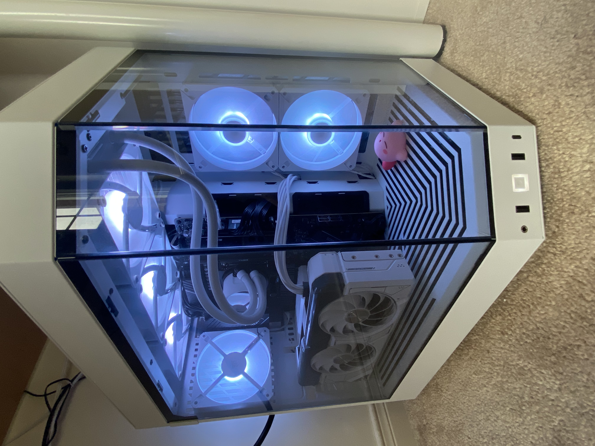
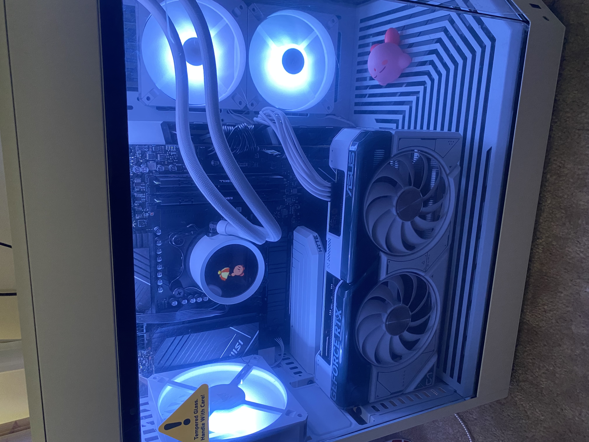
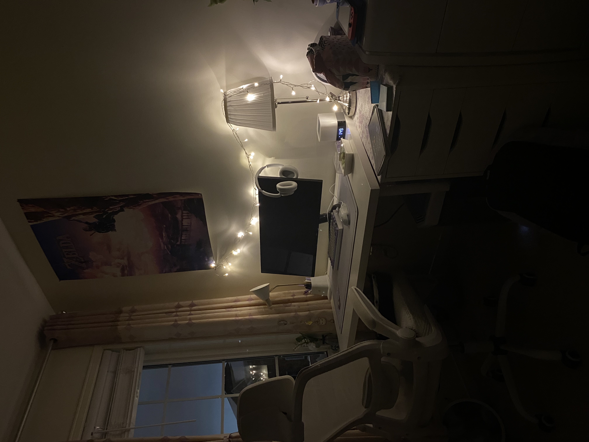
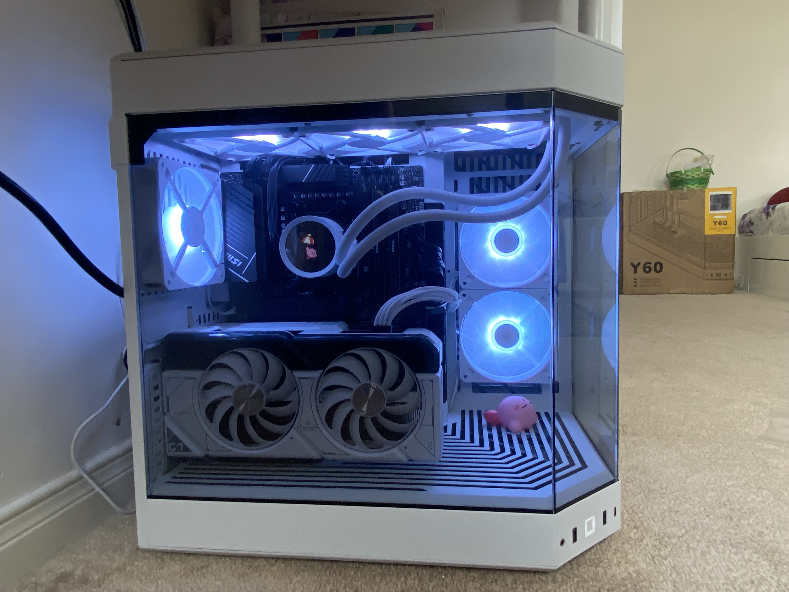
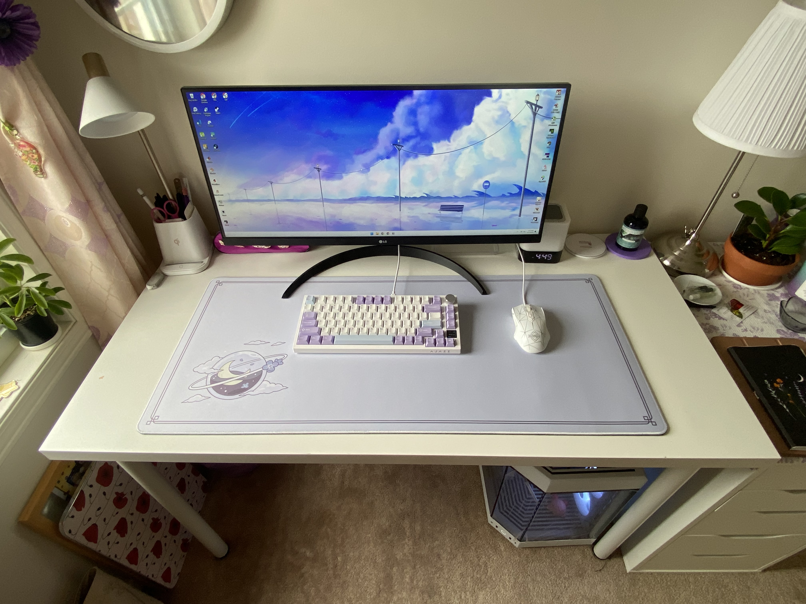
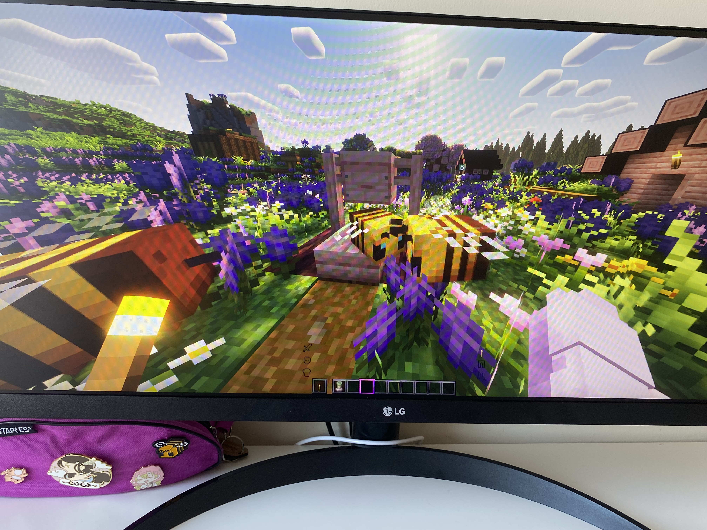
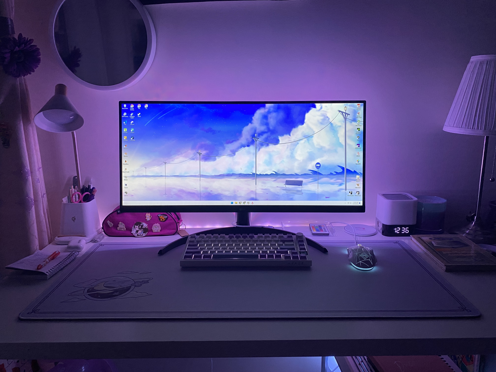

# Custom-PC-Build
A purpose-built PC tailored for an ECE student balancing demanding coursework, personal projects, and gaming. This build prioritizes performance and functionality while maintaining a clean aesthetic, with components carefully selected during Black Friday sales to optimize value.

|  |  |   |
| --- | --- | --- |
|  |  |  |
|  |  |  |
|  |  |  |

## Table of Contents
1. [🎯 User Profile & Requirements](#-user-profile--requirements)
2. [⚙️ PC Specifications](#️-pc-specifications)
    - [Main Components](#main-components)
3. [🖥️ Peripheral Ecosystem](#️-peripheral-ecosystem)
    - [Current Setup](#current-setup)
    - [Workspace Environment](#workspace-environment)
4. [🔮 Future Upgrades Roadmap](#-future-upgrades-roadmap)
    - [High Priority](#high-priority)
    - [Quality of Life](#quality-of-life)
5. [📚 Skills Learned & Applied](#-skills-learned--applied)
    - [Technical Hardware Skills](#technical-hardware-skills)
    - [Build & Assembly Expertise](#build--assembly-expertise)
    - [Planning & Research](#planning--research)
    - [Tools & Software](#tools--software)
    - [Project Management](#project-management)
6. [🙏 Acknowledgements](#-acknowledgements)

## 🎯 User Profile & Requirements

**Primary User:** Electrical and Computer Engineering (ECE) Student

**Use Cases:**
- **Academic:** Multitasking between IDEs, simulation software, documentation, and research
- **Productivity:** Studying, Software development, circuit design tools, and resource-intensive applications
- **Gaming:** Heavily modded Minecraft, modern AAA titles, and various indie games
- **Personal Projects:** software development, integrations of software and hardware, and 3D modelling.

**Priority Hierarchy:**
1. **Functionality** - Raw performance and reliability for demanding workloads
2. **Aesthetic** - Clean, white-themed build with RGB accents
3. **Budget** - Value-focused with Black Friday discounts maximizing cost-to-performance

## ⚙️ PC Specifications

### Main Components

**CPU:** [AMD Ryzen 7 7800X3D](https://www.amd.com/en/products/processors/desktops/ryzen/7000-series/amd-ryzen-7-7800x3d.html)
- 8 Cores / 16 Threads for excellent multitasking
- Large 96MB L3 3D V-Cache, ideal for simulation software and heavily modded games
- High single-core performance for gaming and general productivity
- Incredible power efficiency
- AMD EXPO technology for easy memory overclocking

**GPU:** [ASUS Dual GeForce RTX 4070 - White OC Edition](https://www.asus.com/ca-en/motherboards-components/graphics-cards/dual/dual-rtx4070-o12g-white/)
- 12GB of GDDR6X VRAM for high-resolution textures and mods
- DLSS 3 with Frame Generation for boosted performance in supported games
- White aesthetic to match the build theme
- NVIDIA Studio Drivers beneficial for content creation and engineering software

**Motherboard:** [MSI Pro B650-P WIFI](https://www.msi.com/Motherboard/PRO-B650-P-WIFI)
- Supports PCIe 5.0 for future storage upgrades
- Robust power delivery system for stable CPU performance
- Built-in Wi-Fi 6E and 2.5G LAN
- Four DDR5 DIMM slots with EXPO support
- Multiple M.2 slots for storage expansion

**RAM:** [GSkill Flare X5 32GB (2x16GB) DDR5](https://www.gskill.com/product/165/396/1662622664/F5-6000J3636F16GX2-FX5)
- 32GB total capacity for heavy multitasking and virtual machines
- Optimized speed of DDR5-6000 for AMD Ryzen 7000 series
- Low latency timings (CL36)
- AMD EXPO certified for one-click stable overclocking
- Low-profile design to avoid conflicts with large CPU coolers

**Storage:** [Inland QN322 2TB SSD](https://www.techpowerup.com/ssd-specs/inland-qn322-2-tb.d1444)
- High-speed Gen4 NVMe PCIe interface
- 2TB of capacity for OS, applications, games, and projects
- Fast read/write speeds reduce loading times significantly
- DRAM cache for sustained performance
- M.2 form factor for clean, cable-free installation

**PSU:** [Aresgame AGT850](https://www.aresgame.com/POWER.php?id=28&&name=AGT850)
- 850W output provides ample power for current components and future upgrades
- 80+ Gold certification for high power efficiency
- Fully modular design for a clean and minimal cable setup
- Quiet 120mm hydraulic bearing fan
- Protections including OVP, UVP, OCP, OPP, and SCP

**Case:** [Hyte Y60 - Snow White](https://hyte.com/store/y60/cs-hyte-y60-ww?srsltid=AfmBOooWNnUulXkcXgd8aNGF0yUYMsFuU2U80WNj-LbhLCHYn_DpEz2k)
- Distinctive dual-chamber design for superior cable management and airflow
- Tempered glass panels to showcase components
- Pre-installed PCIe 4.0 riser cable for vertical GPU mounting
- Supports 360mm radiators at the top
- White finish creating a bright, clean aesthetic

**CPU Cooler:** [NZXT Kraken 360 RGB - White](https://nzxt.com/products/kraken-360-rgb?srsltid=AfmBOoooFas0trfDnvWGCImldhyNFDfbdqcWcwuKQbMR7MjDuHO0yjBa)
- 360mm radiator provides exceptional cooling for the 7800X3D
- RGB infinity mirror cap on the pump head for customization
- Quiet operation even under heavy loads
- NZXT CAM software integration for monitoring and control
- Easy installation bracket system

**Fans:** [Corsair iCUE AR120 RGB - White](https://www.corsair.com/ca/en/p/case-fans/co-9050169-ww/icue-ar120-digital-rgb-120mm-pwm-fan-triple-pack-white-co-9050169-ww)
- PWM control for dynamic speed adjustment based on temperature
- Bright, customizable RGB lighting via iCUE software
- White color scheme to maintain the build's aesthetic
- Low-noise operation
- Airflow-optimized blade design

## 🖥️ Peripheral Ecosystem

### Current Setup
The user specifically requested to continue using these as to reduce the overall cost of their setup.
- **Monitor**: [LG 29” UltraWide](https://www.lg.com/ca_en/monitors/ultrawide/29wq500-b/) - Provides adequate workspace for coding and documentation and multiple applications open on one screen without comprimising its optimal size.
- **Mouse**: [AJAZZ AJ52 - White](https://ajazzbrand.com/products/ajazz-aj52-mouse?srsltid=AfmBOopitdJwuDJQ3O0E8jykWxbtBRj_sIArfwCgYR6dMoHt25t4r7fo) - Familiar input device for precision work

### Workspace Environment
- **Keyboard**: [AJAZZ AK820 Pro - Purple](https://ajazzstore.com/products/ajazz-ak820-pro?variant=42723205677109) - Mechanical feel for long coding sessions with tri-connectivity (Bluetooth 5.0, 2.4GHz, and wired)
- **Deskmat**: [Osume Lilac Dreams - Large](https://osume.com/en-ca/products/lilac-dreams-standard-deskmat) - Large surface area with simple pleasing aesthetics
- **Lighting**: [Quntis Monitor Light Bar](https://www.amazon.ca/Quntis-Computer-Auto-Dimming-Adjustment-Reading/dp/B08DKQ3JG1/ref=sr_1_5?crid=FBRY1Q2BKCUH&dib=eyJ2IjoiMSJ9.i6fX6CYdYm933a9ezC6fs8boY8sCtdkkQGYFG8UB5_z9JQLPbRJdOJr82a4gAiVWfNwuqMojEFWlNhbC4HjE55s0f0lJ4r3eyTAGZdRooluzUoSY21Y3IdUa8bPdmJjH2ceNkADIWqeD77N31Fyq0UXT4hKwAjFffyEai2QfOdcFElHM9ZIznZ3ZHhHDcZSjzbZeULzOL8OZremNYhN_2kcQ9tAoIiy8URnQbAKoCeTouakXUaIGwL_jL8mvLg8SGWMGqkPHLUFeu9yEV5-O53GIIAK1rHgxrgVej6RL8is.JJwQgcxmhk1y_QmD-aUoCr_5dXXxBV5X6KujXbBsO1I&dib_tag=se&keywords=benq+monitor+bar&qid=1758655913&s=electronics&sprefix=benq+mointor+bar%2Celectronics%2C71&sr=1-5) - Reduces eye strain during late-night work / study sessions
- **Headphones**: [Sony WH-CH720N - White](https://www.amazon.ca/dp/B0BS74M665/?coliid=I3CR72NEX44ZZL&colid=36ZC2L2LP6I7Q&psc=1&ref_=list_c_wl_lv_ov_lig_dp_it) - Noise cancelling wireless
- **Chair**: [CYKOV Ergonomic Chair](https://www.amazon.ca/%F0%9D%91%B6%F0%9D%91%AD%F0%9D%91%AD%F0%9D%91%B0%F0%9D%91%AA%F0%9D%91%AC-%F0%9D%91%AA%F0%9D%91%AF%F0%9D%91%A8%F0%9D%91%B0%F0%9D%91%B9-Ergonomic-Adjustable-Executive/dp/B0CF52Y6H7/ref=sr_1_5?crid=1JHV07EYQ1GVT&dib=eyJ2IjoiMSJ9.Dnnd2okWRmt5LIezX0oPDWQg9T6G_DV74sgKbGC-fB_QhWAcsXYtUfIGhEPQCjQZ4Qc0l5-QAVvGEYX9Cd3ZYVvpEYVoc7FDSmeNjfVaicrUub0vEWV-0QSnQbWK9dQuoBDcwoiZSXuTVHO2Jr2qCMs6jeAgqd1-hIBik19q9yqViocEMbViSzCfknKpPjhxgqQ3GT3Ppfr6Yt2E_mNmIUIYlsJlw4EZGh20ZQdoDYVe-AmwrP7C9SO3MTkp8vbnLCxPMbsDwZ8u2NgK60nxY6DyJ6ZCyDPb2coP5QOXiWI.j5zhoF--r5kcC7hUFsbAyE8Uwwhg6zCPftENyi30HXA&dib_tag=se&keywords=white%2Bergonomic%2Boffice%2Bchair&qid=1758655721&sprefix=white%2Bergon%2Caps%2C123&sr=8-5&th=1) - Supports long study/gaming sessions comfortably
- **Desk**: [Ikea Trotten Tabletop - White 180cm x 60cm](https://www.ikea.com/ca/en/p/trotten-tabletop-white-70474750/) and [Ikea Adils Table Legs - White](https://www.ikea.com/ca/en/p/adils-leg-white-90217972/) - Spacious surface for multiple monitors, peripherals, and all coursework (note taking, assignments, practice questions, and circuit building, etc.)

## 🔮 Future Upgrades Roadmap

### High Priority

**Monitors:** [DecoGear 39" 2K Curved Monitor - White (2 Pack)](https://www.decogear.com/collections/monitors/products/deco-gear-39-curved-ultrawide-gaming-monitor-view391wht)
- 39-inch 2K curved ultrawide screens provide immense screen real estate for coding, research, and applications side-by-side
- 144Hz refresh rate ensures smooth scrolling and a great gaming experience
- White finish perfectly matches the existing build aesthetic

**Keyboard Wrist Rest:** [SELORSS Acrylic Keyboard Wrist Rest](https://www.amazon.ca/dp/B0BND5YYQN/?coliid=I6BL2J25WYZF&colid=1ES4EUEKFPLL1&psc=1&ref_=list_c_wl_lv_ov_lig_dp_it)
- Transparent acrylic design maintains a clean, modern look
- Ergonomic height and angle reduces strain on wrists during long typing sessions
- Easy to clean surface maintains its appearance over time

### Quality of Life

**Desktop Speakers:** [Creative Pebble 2.0 USB-Powered Desktop Speakers - White](https://www.amazon.ca/dp/B0791J2658/?coliid=I5XILRRT9602W&colid=1ES4EUEKFPLL1&psc=1&ref_=list_c_wl_lv_ov_lig_dp_it)
- Compact, modern white design that fits the workspace theme
- USB-powered for simple, cable-free setup from the monitor or PC
- Clear audio quality for music, videos, and conference calls

**Monitor Stand:** [VIVO Dual Monitor Stand](https://www.amazon.ca/dp/B0CRH96V9F/?coliid=I33SF1RTOF1N8K&colid=1ES4EUEKFPLL1&th=1) or [HUANUO Dual Monitor Stand](https://www.amazon.ca/dp/B0CJR9RHGP/?coliid=I32WTYQNDUVS97&colid=1ES4EUEKFPLL1&th=1)
- Frees up significant desk space by elevating the monitors
- Full adjustability (tilt, swivel, height) for an ergonomic viewing angle
- Built-in cable management for a clean and organized look

**Cable Management:** [Ikea Signum Cable Management](https://www.ikea.com/ca/en/p/signum-cable-management-horizontal-silver-color-30200253/)
- Horizontal rack that mounts neatly under the desk, hiding all cables from view
- Durable steel construction capable of holding power bricks and multiple cables
- Simple installation that requires no special tools

**Wireless Controller:** [8Bitdo Ultimate 2C Wireless Controller - Purple](https://www.amazon.ca/dp/B0D72TNXSC/?coliid=I2URYJ86TNMQXR&colid=3J32FENSIKXTO&psc=1&ref_=list_c_wl_lv_ov_lig_dp_it)
- 2.4GHz wireless connection for lag-free gaming on PC and emulators
- Comfortable ergonomic design suitable for long gaming sessions
- Hall Effect joysticks and Hall triggers and wear-resistant metal joystick rings

**Ergonomic Mouse:** [Uineer U6 Ergonomic Mouse - Purple](https://www.amazon.ca/dp/B0DKJSVWTX/?coliid=I2R3KQUA78XUEB&colid=OIZDG1IM6QPH&th=1) or [Redragon M916 PRO - White](https://www.amazon.ca/dp/B0CPXYQTPF/?coliid=I3NW4J2CVTGQG5&colid=OIZDG1IM6QPH&th=1)
- **Uineer U6:** Vertical design promotes a natural handshake grip to reduce wrist strain
- **Redragon M916:** Symmetrical white design with programmable buttons for productivity
- Both offer wireless connectivity to reduce desk clutter

**Mug Warmer:** [House Gem Mug Warmer](https://www.amazon.ca/dp/B0CCP46DK9/?coliid=I3EKLDXVGQ5V4Z&colid=1REL3F142F5J5&th=1)
- Maintains the perfect drinking temperature for coffee, tea, and other hot beverages
- Automatic shut-off feature for safety and peace of mind
- Keeps drinks warm for peak productive vibes without disrupting your train of thought for a trip to reheat those awkward lukewarm drinks

## 📚 Skills Learned & Applied

### Technical Hardware Skills
- **PC Component Selection** - Researched and selected compatible hardware for optimal performance and budget
- **System Architecture Understanding** - Knowledge of how CPU, GPU, RAM, storage, and motherboard interact
- **Power Management** - Proper PSU selection and wattage calculation for system stability
- **Thermal Management** - CPU cooler installation and case airflow optimization for efficient cooling
- **Cable Management** - Professional wiring techniques for optimal airflow and aesthetics

### Build & Assembly Expertise
- **Motherboard Installation** - Proper mounting and standoff installation
- **Component Handling** - Safe installation of sensitive components (CPU, RAM, GPU)
- **Storage Configuration** - SSD/HDD installation and mounting
- **Front Panel Connectivity** - System panel headers, USB, and audio connections
- **Troubleshooting** - POST testing and diagnostic procedures

### Planning & Research
- **Budget Optimization** - Maximizing performance per dollar spent
- **Compatibility Verification** - Ensuring all components work together seamlessly
- **Future-Proofing** - Selecting components with upgrade paths in mind
- **Use-Case Analysis** - Tailoring component selection to specific computing needs (gaming, productivity, etc.)

### Tools & Software
- **Hardware Tools** - Proper use of anti-static equipment and assembly tools
- **BIOS Configuration** - System setup and hardware recognition
- **Driver Installation** - Operating system and hardware driver setup

### Project Management
- **End-to-End Project Execution** - From research and planning to final assembly
- **Documentation** - Creating comprehensive build logs and guides
- **Problem Solving** - Overcoming compatibility issues and assembly challenges

## 🙏 Acknowledgements

- Black Friday/Cyber Monday deals for making premium components accessible
- ECE community for workload-specific performance recommendations
- PC building communities for troubleshooting assistance and best practices
- Component manufacturers for detailed specifications and compatibility guidance

---

*Built with ❤️ for the ECE student who needs both computational power, seamless productivity, and gaming capability in one versatile machine.*